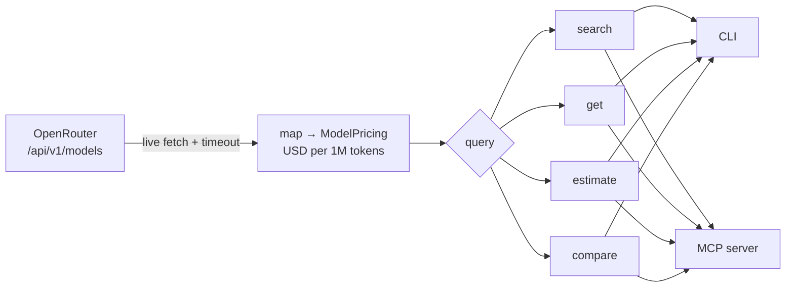

<div align="center">

# 💸 tokenomics

### Fresh, live LLM pricing for AI agents — as a CLI **and** an MCP server.

No scraping. No database. No API keys. Every call returns current pricing for **400+ models**,
straight from the [OpenRouter Models API](https://openrouter.ai/docs/guides/overview/models)
and normalized to **USD per 1M tokens**.

[](LICENSE)
[](https://nodejs.org)
[](https://effect.website)
[](https://modelcontextprotocol.io)
[](https://prettier.io)
[](https://oxc.rs)

</div>

---

## Why

LLMs in agents need to reason about cost — _which model is cheapest for this job, what will this prompt cost, is the cheaper model worth it?_ — but pricing data goes stale the moment you hardcode it. **tokenomics** gives an agent a single, always-fresh source of truth and does the per-million math so the agent never fumbles a `1K` vs `1M` conversion.

It's built the way Anthropic recommends agent tools should be built: a small set of **deep, workflow-level tools** (not a CRUD wrapper), JSON-by-default output, runtime schema introspection, input hardening, and field masks to keep responses small.

## Features

|                               |                                                                                               |
| ----------------------------- | --------------------------------------------------------------------------------------------- |
| 🔴 **Always live**            | Fetches OpenRouter on every call — data is fresh by construction. No DB to go stale.          |
| 🔌 **Two surfaces, one core** | The same engine powers an agent-friendly CLI and an MCP server. Identical behavior.           |
| 🧮 **Does the math**          | `estimate` and `compare` compute real USD cost from token counts and request volume.          |
| 🤖 **Agent-first**            | JSON when piped, field masks, NDJSON, machine-readable errors, schema introspection.          |
| 🧰 **MCP best-practices**     | Rich server instructions, structured tool descriptions, graceful timeouts, soft "not found".  |
| 🛡️ **Hardened input**         | Rejects control chars, path traversal, and embedded query params at the boundary.             |
| ⚡ **Typed & tested**         | Built on [Effect](https://effect.website) with tagged errors; Prettier + oxlint + unit tests. |

## Quickstart

**One-command install** (clone, build, and put `tokenomics` + `tokenomics-mcp` on your PATH):

```bash
git clone https://github.com/tylergibbs1/tokenomics.git && cd tokenomics && npm install && npm run build && npm link
```

<details>
<summary>Prefer it step by step?</summary>

```bash
git clone https://github.com/tylergibbs1/tokenomics.git
cd tokenomics
npm install
npm run build
npm link        # optional: puts the binaries on your PATH
```

</details>

Requires **Node 20+**. No API key needed — the OpenRouter `/models` endpoint is public.

## CLI

Output is **JSON when piped** (agent-friendly) and a **table at a terminal**. Override with `-o json|ndjson|table`.

```bash
# 🔎 Search + filter, and trim the response with a field mask
tokenomics search "claude" --max-input 5 --min-context 200000 \
  --fields model_id,pricing,context_window

# 📄 One model's full pricing + provenance
tokenomics get openai/gpt-4o

# 🧮 Cost of a workload (raw token counts) × N requests
tokenomics estimate openai/gpt-4o --input-tokens 1000000 --output-tokens 200000 --requests 10

# ⚖️  Rank candidates by total cost for the same workload (cheapest first)
tokenomics compare --models openai/gpt-4o,google/gemini-2.5-flash \
  --input-tokens 1000000 --output-tokens 500000

# 🏷️  Providers present in the live data, with counts
tokenomics providers

# 📐 Runtime schema introspection — the CLI documents itself
tokenomics schema estimate
```

<details>
<summary><b>Example output</b> — <code>tokenomics get openai/gpt-4o</code></summary>

```json
{
  "provider": "openai",
  "model_id": "openai/gpt-4o",
  "display_name": "OpenAI: GPT-4o",
  "modality": "multimodal",
  "pricing": {
    "input_per_mtok": 2.5,
    "output_per_mtok": 10,
    "cached_input_per_mtok": null,
    "cache_write_per_mtok": null
  },
  "context_window": 128000,
  "max_output_tokens": 16384,
  "unit": "USD per 1M tokens",
  "currency": "USD",
  "source_url": "https://openrouter.ai/models/openai/gpt-4o",
  "fetched_at": "2026-06-25T16:00:21.174Z",
  "source": "openrouter"
}
```

</details>

Errors are machine-readable on stderr with a stable `code`, an actionable `suggestion`, and a non-zero exit:

```json
{
  "error": true,
  "code": "MODEL_NOT_FOUND",
  "message": "No model matching 'gtp-4o'.",
  "suggestion": "Use 'tokenomics search' to list available models.",
  "details": { "suggestions": [] }
}
```

## MCP server

Four **read-only, workflow-level** tools — each bundles the live fetch, model matching, and cost math so an agent needs one call, not three.

| Tool                | Use it for                                                               |
| ------------------- | ------------------------------------------------------------------------ |
| `search_models`     | Discover / shortlist models by price, modality, or context window        |
| `get_model_pricing` | One known model's full pricing (a miss returns candidates, not an error) |
| `estimate_cost`     | The USD cost of a workload on a single model                             |
| `compare_models`    | Rank candidate models by total cost for the same workload                |

### Add to Claude Code

```bash
claude mcp add tokenomics -- node /absolute/path/to/tokenomics/dist/bin/tokenomics-mcp.js
```

### Add to Claude Desktop

```jsonc
// claude_desktop_config.json
{
  "mcpServers": {
    "tokenomics": {
      "command": "node",
      "args": ["/absolute/path/to/tokenomics/dist/bin/tokenomics-mcp.js"],
    },
  },
}
```

The server ships rich `instructions` (purpose, the units convention, when to use which tool) that clients surface to the model automatically.

## Units (the one thing to remember)

- **Every price is USD per 1,000,000 tokens.** `2.5` means $2.50 per 1M tokens.
- `estimate` / `compare` take **raw token counts** (e.g. `1000000`), not millions.
- `output_per_mtok: null` ⇒ non-generative model (embeddings/rerankers); output tokens cost $0.
- Model ids are `provider/model`, e.g. `openai/gpt-4o`, `anthropic/claude-3.5-sonnet`.

## How it works



A single `OpenRouter` Effect service fetches and normalizes the catalog (cached in-process for `TOKENOMICS_CACHE_TTL_SECONDS`, default 60s). Both the CLI and the MCP server call one shared operations layer, so they behave identically and share typed, tagged errors.

## Configuration

All optional — sensible defaults work out of the box.

| Variable                       | Default                               | Description                                                                       |
| ------------------------------ | ------------------------------------- | --------------------------------------------------------------------------------- |
| `OPENROUTER_API_URL`           | `https://openrouter.ai/api/v1/models` | Source endpoint (override to proxy)                                               |
| `TOKENOMICS_CACHE_TTL_SECONDS` | `60`                                  | In-process reuse window; `0` = fetch fresh every call                             |
| `TOKENOMICS_FETCH_TIMEOUT_MS`  | `15000`                               | Hard timeout so a hung network fails fast                                         |
| `TOKENOMICS_STRICT_LOOKUP`     | `false`                               | `1` makes a `get_model_pricing` miss a hard error instead of returning candidates |

## Development

```bash
npm run dev:cli -- search "gpt"   # run the CLI from source (tsx)
npm run dev:mcp                    # run the MCP server from source
npm run check                     # prettier --check + oxlint + tsc --noEmit
npm test                          # unit tests for the pricing math
```

## Roadmap

- [ ] Additional pricing sources (direct provider pages) as sibling Effect services, merged transparently
- [ ] Token counting from raw text/files so `estimate` can price an actual prompt
- [ ] Server-side OpenRouter sorts/filters (throughput, tool-calling support)
- [ ] Publish to npm + `.mcpb` bundle for one-click Desktop install

## License

[MIT](LICENSE) © Tyler Gibbs

<div align="center">
<sub>Built for agents, with <a href="https://effect.website">Effect</a> + the <a href="https://modelcontextprotocol.io">Model Context Protocol</a>.</sub>
</div>
